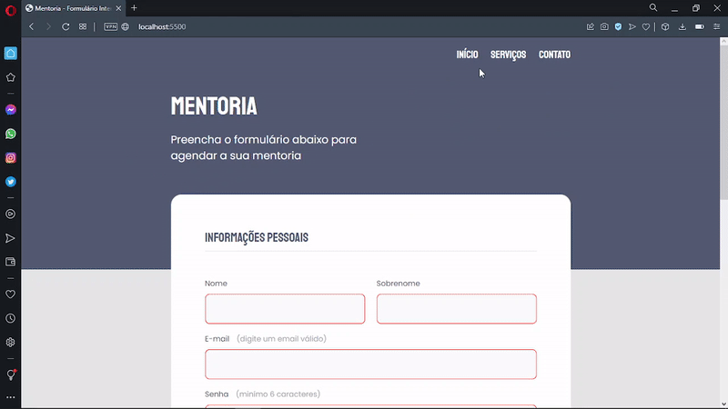
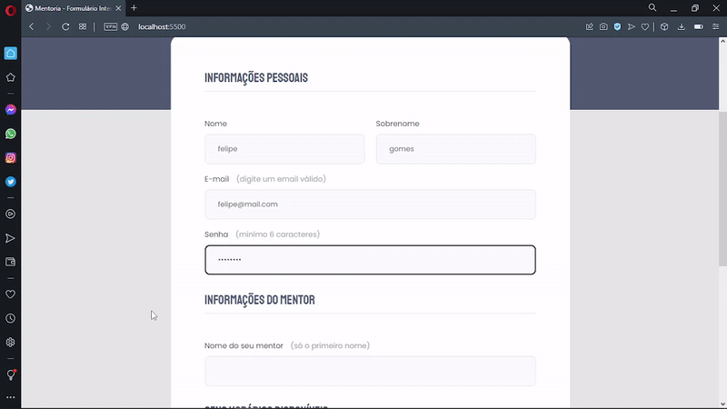
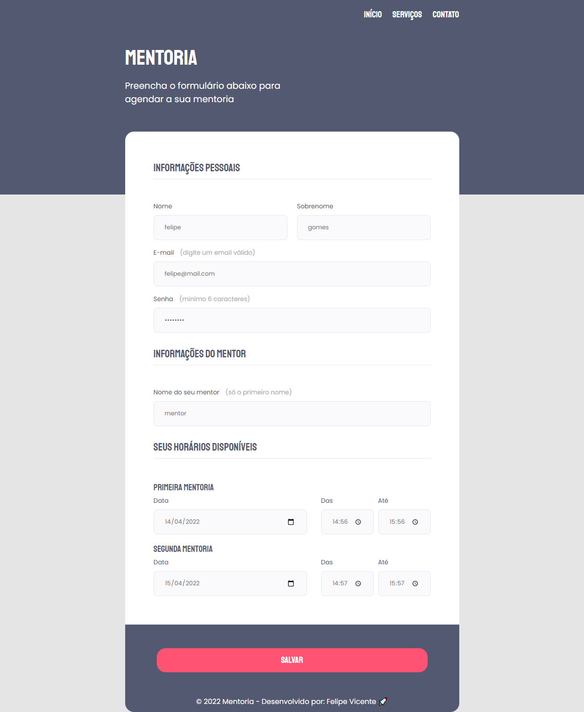

# Mentoria

<div align="center">
    
    <br />
    <p>Continuação do GIF</p>
    
</div>

<br />

### 💻 Mentoria 

O desafio desse é construír uma página web do zero utilizar o layout do protótipo 
disponível no figma, fortalecer meu conhecimento de HTML e CSS em aplicar conceitos 
e o que foi visto nos projetos anteriores do Stage 2 e aulas no Stage 3 sobre construção de um formulário, validação dos campos. 
Desafeei-me em aplicar conceitos na pagina web barra de navegação e rodapé, que originalmente não tem no protótipo do figma.

Acesse a página do projeto: [Clique Aqui](https://felipe-gomes-vicente.github.io/mentoria-formulario/)

O que foi feito:

- Desafeei-me ao criar a barra de navegação e rodapé;
- Agrupando campos com fieldset e legend;
- Formatando o campo de texto;
- Validando campos e submetendo formulários;
- Posição dos elementos na tela;
- Importar arquivo de CSS externo no projeto;
- Aplicando fontes(tipografia) customizadas no arquivo do CSS e iniciando o CSS externo;
- Validação dos campos com CSS;
- Variáveis CSS;
- Trabalhando com cores e fontes;
- Alinhando e posicionando textos e elementos;
- Aplicando os espaçamentos;
- Bordas e classificações de elementos;
- O conceito Box Model do CSS;
- Efeito nos elementos HTML de links e botão;
- Reset CSS removendo possíveis inconsistências entre navegadores diferentes;
- Estrutura de sistema de arquivos do projeto separado por pasta;


Aplicado meu conhecimento do Explorer da Rocketseat conceitos de forma prática nesse projeto, com as aulas:

- Introdução ao HTML e CSS;
- Conhecendo novos conceitos de HTML e CSS;
- Formulários, Validações e Customizações;
  
<br />

- [EXPLORER - Rocketseat](https://www.rocketseat.com.br/explorer)
- [Figma do Projeto - Mentoria Formulário](https://www.figma.com/file/Nws1KWB7DyXBw8L6wXb9mp?node-id=0:1)

## Imagem do Projeto concluído:
 


## 🧪 Tecnologias

Aplicação desenvolvida usando as seguintes tecnologias:

- [HTML5](https://www.w3schools.com/html/default.asp)
- [CSS3](https://www.w3schools.com/css/default.asp)

## 🚀 Iniciar Projeto

Live server com VScode ou apenas clonar pasta e acessar o index.html

### Programas necessários para iniciar projeto

- [Live Server (Opcional)](https://marketplace.visualstudio.com/items?itemName=ritwickdey.LiveServer)
- [Visual Studio Code - Vscode](https://code.visualstudio.com/)

Clone o projeto e acesso a pasta.

```bash
$ git clone https://github.com/felipe-gomes-vicente/mentoria-formulario.git
$ cd mentoria-formulario
```

## 📝 Licença

Esse projeto está sob a licença MIT. Veja o arquivo [LICENSE](LICENSE.md) para mais detalhes.

---

&nbsp;

<p align="center">Feito com 💜 by Felipe Vicente👋</p>

- ## Meu LinkedIn - [](https://www.linkedin.com/in/felipe-gomes-vicente/)
